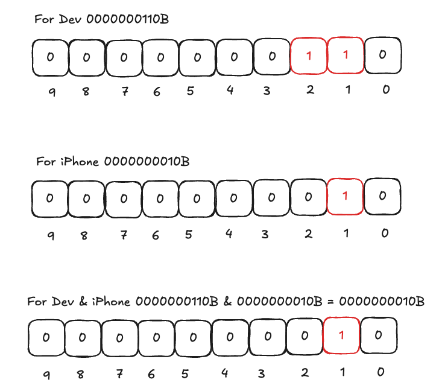
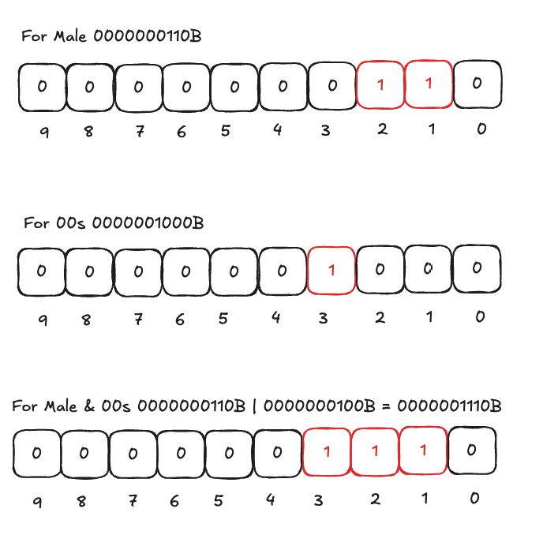

# 什么是bitmap

Bit-Map算法又名位图算法，其原理是，使用下标代替数值或特定的意义，使用这个位为0或者1代表特性是否存在
Bit-Map算法具有效率高，节省空间的特点，适用于对大量数据进行去重，查询等

> [!NOTE]
> 对于某个标签，给出一个长度为n的数组，初始化都为0，如果来了一个用户或者一个用户符合当
> 前标签，我们就将这个数组的某个位置置为1。基于当前标签进行统计某些值的时候就很快

# 从案例来理解bitmap

1. 建立用户名和id的映射关系  
  现在有标签宽表如下：

|Name|Sex|Age|Occupation|Phone|
|:---:|:---:|:---:|:---:|:---:|
|A|male|90s|Dev|iPhone|
|B|male|90s|dev|San|
|C|female|00s|student|mi|

  构建映射关系之后

|ID|Name|
|:---:|:---:|
|1|A|
|2|B|
|3|C|

2. 将标签宽表使用bitmap进行拆分  

|Sex|bitmap|
|:---|:---|
|male|1, 2|
|female|3|

|Age|bitmap|
|:---|:---|
|90s|1, 2|
|00s|3|

|Occupation|bitmap|
|:---|:---|
|Dev|1, 2|
|student|3|

3. 使用bitmap进行查询

# bitma的使用

## bitmap的存储
如果用户id是int类型，那么就是有**4 bytes, 32bit**的存储开销，而在bitmap中，一个用户实际上也就只占来一个bit，内存开销直接节省32倍

## bitmap的使用

> [!TIP]
> bitmap在用户群做交集和并集运算的时候速度很快，主要是用位图异或计算

我想计算是**dev，并且使用iPhone**的人群

我想计算**male 或 00s**的人群

由此可以发现，使用位进行计算的速度是非常快，计算的效率非常高

我想计算 **not 90s**的人群
从age的表中可以知道，90s只有AB两人，00s则有C一人。not 90s人群，也就是计算出C来。如果直接计算not 90s，这样就会导致一个问题，具体结果如下：

> [!IMPORTANT]
> 直接计算不太可行，因此还要借助一个全量用户来进行辅助计算，**90s XOR ALL = not 90s**，也就是异或计算：**相同为0，不同为1**

# bitmap的优化

